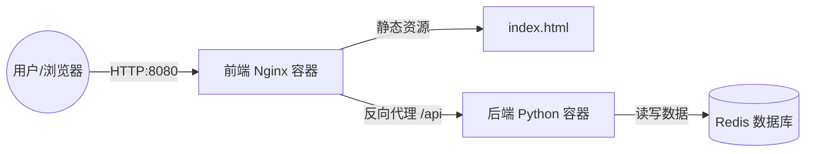

# ☁️ 云计算技术期末大作业 - 第25组

> **题目 A6**：基于 Docker 的 Nginx 容器化部署与微服务架构演进


## 📂 项目简介
本项目是《云计算技术》课程的期末实验作业。我们不仅完成了基础的 Nginx 静态网站容器化部署，还进一步将其升级为**基于 Docker Compose 的三层微服务架构**。

项目实现了前端（Nginx）、后端（Python Flask）和数据库（Redis）的分离与编排，模拟了现代云原生应用的开发与部署流程。

### 👥 小组成员信息
| 班级 | 组号 | 姓名 | 学号 | 分工 |
| :--- | :--- | :--- | :--- | :--- |
| 23大数据1班 | 25 | (周子棋40%) | (2362160025) | 环境搭建、脚本编写、微服务调试 |
| 23大数据1班 | 25 | (路雲通30%) | (2362160058) | 镜像构建、后端开发、功能验证 |
| 23大数据1班 | 25 | (朱星宇30%) | (2362160027) | 镜像构建、文档编写、排错记录、PPT制作 |

---

## 🛠️ 技术架构 (Architecture)

我们将应用拆分为三个独立的容器服务，通过 Docker 内部网络进行通信：



* **Web (Nginx)**: 负责静态页面展示，并作为反向代理网关转发 API 请求。
* **Backend (Flask)**: 处理业务逻辑，计算访客数量。
* **Database (Redis)**: 内存数据库，持久化存储访客计数。

---

## 📂 项目结构

```text
.
├── docker-compose.yml       # [核心] 微服务编排文件
├── run.sh                   # [基础] 单体容器启动脚本 (Legacy)
├── nginx/                   # Nginx 配置目录
│   └── default.conf         # 定义反向代理规则
├── backend/                 # Python 后端目录
│   ├── Dockerfile           # 后端镜像构建文件
│   ├── app.py               # Flask 业务代码
│   └── requirements.txt     # Python 依赖
├── src/                     # 前端网页源码
│   └── index.html           # 包含 JS 逻辑的入口文件
├── report/                  # 实验报告
│   └── ...                  # 详细的实验过程与截图
└── assets/                  # 截图素材

```

---

## 🚀 快速开始 (Quick Start)

### 环境要求

* Docker Engine
* Docker Compose (v2.x 推荐)

### 1. 克隆仓库

```bash
git clone [https://github.com/ZZQ-77756/cloud-final-class1-group25-A6.git](https://github.com/ZZQ-77756/cloud-final-class1-group25-A6.git)
cd cloud-final-class1-group25-A6

```

### 2. 启动微服务 (推荐方式)

使用 Docker Compose 一键构建并启动所有服务：

```bash
sudo docker compose up -d --build

```

### 3. 验证功能

* **查看状态**：
```bash
sudo docker compose ps

```


*预期结果：看到 web, backend, redis 三个容器均处于 `Up` 状态。*
* **访问网页**：
打开浏览器访问 `http://localhost:8080` (或虚拟机 IP:8080)。
*预期结果：看到带有蓝色边框的网页，且“当前访客数”随刷新增加。*
* **测试 API**：
```bash
curl localhost:8080/api/hello

```


*预期结果：返回包含 `visit_count` 的 JSON 数据。*

---

## 🔧 基础模式 (Legacy Mode)

如果你只需要运行最基础的 Nginx 静态页面（不包含后端和数据库），可以使用我们就绪脚本：

```bash
chmod +x run.sh
./run.sh v1

```

---

## ✨ 实现亮点

1. **微服务编排**：使用 `docker-compose.yml` 管理服务依赖 (`depends_on`)，无需手动逐个启动容器。
2. **反向代理 (Reverse Proxy)**：通过 Nginx 配置 `proxy_pass`，解决了跨域问题，对外隐藏了后端端口。
3. **数据持久化**：使用 Redis 记录数据，证明了容器重启后数据依然存在。
4. **环境隔离**：后端和数据库运行在 Docker 内部网络中，仅通过 Nginx 暴露必要的 80 端口，增强了安全性。

---

## 📄 实验报告

关于详细的实验步骤、遇到的 **Alpine 镜像拉取超时**、**Docker Compose 版本兼容性** 等问题的排查过程，请查阅：
👉 **[实验报告.md](https://www.google.com/search?q=./report/%E5%AE%9E%E9%AA%8C%E6%8A%A5%E5%91%8A.md)**

```

### 💡 为什么这个 README 更好？
1.  **增加了徽章 (Badges)**：看起来非常专业，一眼就能看出你用了哪些技术栈。
2.  **架构图 (Mermaid)**：用简单的图表解释了微服务是怎么工作的，老师一看就懂。
3.  **重点突出**：把复杂的 `docker-compose` 放在了最前面作为推荐方式，体现了你的工作量和进阶能力，同时也保留了基础的 `run.sh` 作为备选。
4.  **功能分区**：清晰地分成了“架构”、“结构”、“如何运行”和“亮点”，符合标准开源项目的规范。

```
