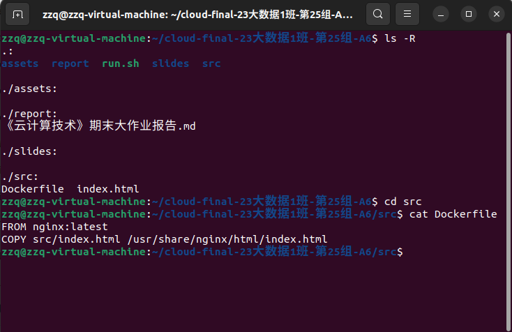
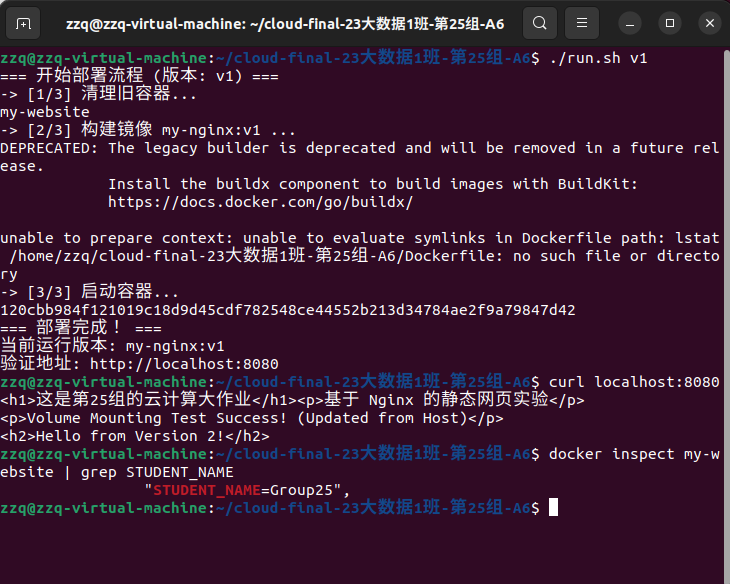
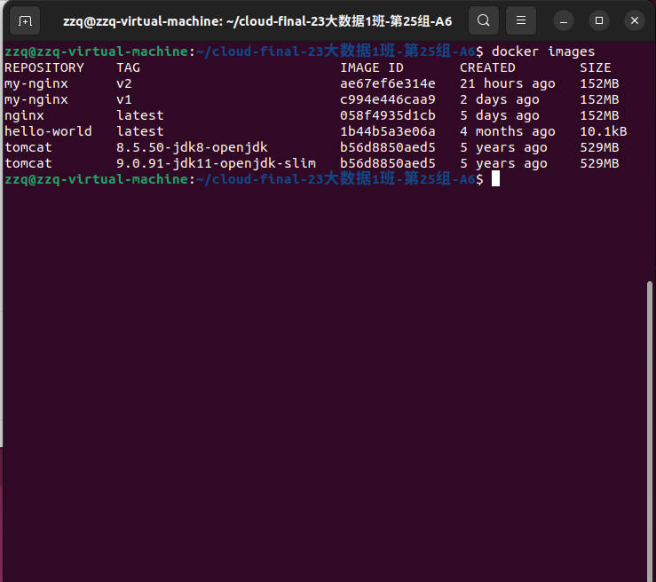
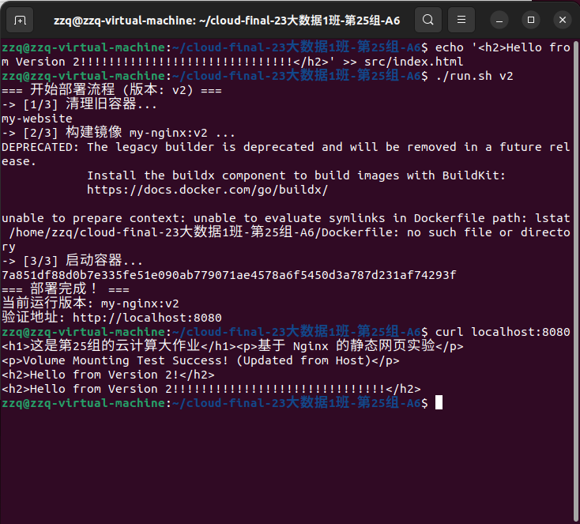

# 《云计算技术》期末实验大作业报告

## 0. 基本信息

| 项目 | 内容 |
| :--- | :--- |
| **课程名称** | 云计算技术 |
| **学期/班级** | 2025-2026学年 / 23大数据1班 |
| **小组编号/组名** | 第 25 组 |
| **选题编号与题目** | A6 / 基于 Docker 的 Nginx 容器化部署与版本管理 |
| **完成日期** | 2026-01-04 |
| **代码仓库地址** | [GitHub Link](https://github.com/ZZQ-77756/cloud-final-class1-group25-A6) |

**小组成员信息：**

| 角色 | 姓名 | 学号 | 分工 |
| :--- | :--- | :--- | :--- |
| 成员1 | (请填写) | (请填写) | 环境搭建与脚本编写 |
| 成员2 | (请填写) | (请填写) | 镜像构建与功能验证 |
| 成员3 | (请填写) | (请填写) | 文档编写与PPT制作 |

---

## 1. 摘要

本项目旨在解决传统 Web 应用部署中环境不一致、依赖管理复杂以及手动部署效率低下的问题。我们采用 Ubuntu 虚拟机作为基础设施，基于 Docker 容器技术栈，实现了一个 Nginx 静态网站的容器化部署方案。

关键功能包括：
* 编写 `Dockerfile` 实现镜像的标准化构建；
* 使用 Shell 脚本（`run.sh`）实现“一键自动化部署”与版本切换；
* 通过端口映射（Port Mapping）实现外部访问；
* 利用卷挂载（Volume Mounting）实现数据的持久化与热更新。

最终，我们成功实现了 v1 和 v2 双版本的无缝切换与管理，验证了容器技术的轻量级与敏捷性。

---

## 2. 需求与目标

* **背景与问题描述**：在传统虚拟机部署模式下，Nginx 的安装配置繁琐，且难以在不同机器间完美复现环境。
* **功能目标（必须项）**：
    * **目标1**：编写 `Dockerfile` 构建自定义 Nginx 镜像。
    * **目标2**：实现容器端口映射（Host:8080 -> Container:80）与环境变量注入。
    * **目标3**：实现宿主机目录挂载，使得修改本地文件能即时反映在容器网页中。
* **性能/可靠性/目标**：提供一个自动化脚本 `run.sh`，确保在任何安装了 Docker 的 Linux 环境下均可一键复现实验结果。
* **不做的范围**：本项目不涉及 Kubernetes 集群编排，仅关注单机 Docker 容器管理；不涉及 Nginx 的复杂反向代理配置。

---

## 3. 相关概念与原理

1.  **容器化 (Containerization)**
    * **解释**：将应用及其依赖打包在一起，实现“一次构建，到处运行”，提供进程级的隔离。
    * **在本项目中的体现**：使用 Docker 将 Nginx 和 HTML 网页打包成 `my-nginx` 镜像，消除了环境差异。

2.  **基础设施即代码 (IaC)**
    * **解释**：通过代码（而非手动点击）来管理和配置基础设施。
    * **在本项目中的体现**：通过 `Dockerfile` 定义镜像结构，通过 `run.sh` 脚本定义运行参数（端口、挂载、变量），实现了部署过程的代码化。

3.  **数据卷 (Data Volumes)**
    * **解释**：绕过容器的文件系统，将宿主机目录直接映射到容器内，用于数据持久化。
    * **在本项目中的体现**：使用 `-v $(pwd)/src:/usr/share/nginx/html`，将本地源码目录挂载到容器，实现了开发环境的“热更新”。

---

## 4. 实验环境与资源清单

### 4.1 硬件与网络
* **机器数量**：1台 (Windows 宿主机 + Ubuntu 虚拟机)
* **CPU/内存**：2 vCPU / 4GB RAM
* **网络环境**：本地 NAT 网络

### 4.2 软件与版本
* **宿主机 OS**：Ubuntu 20.04 / 22.04 LTS
* **Docker 版本**：Docker CE (Latest)
* **基础镜像**：`nginx:latest`
* **开发工具**：VS Code, Git

### 4.3 账号与权限
* **操作系统用户**：`zzq` (具备 sudo 权限)
* **Git 权限**：配置了 Personal Access Token 用于代码推送。

---

## 5. 总体方案设计



### 5.1 架构简图

```plaintext
[用户浏览器/curl]
       |
       v (访问 HTTP 请求)
[宿主机 Ubuntu (localhost:8080)]
       |
       +---(端口映射 -p 8080:80)---+
                                   |
                          [Docker 容器 (my-website)]
                          |        |
           (环境变量注入) |        | (卷挂载 -v)
           STUDENT_NAME   |        v
                          +--- [宿主机目录 ./src/index.html]

```

---

## 6. 实现过程

### 6.1 准备工作

* **环境检查**：确认 Docker 服务已启动 (`systemctl status docker`)。
* **文件结构**：创建 `src` 目录用于存放网页，创建 `Dockerfile` 用于定义镜像。

### 6.2 核心步骤与命令清单

#### 步骤 1：编写 Dockerfile

我们将官方 Nginx 镜像作为基础，并配置默认文件路径。

* **命令**：`vim Dockerfile`
* **内容**：
```dockerfile
FROM nginx:latest
COPY src/index.html /usr/share/nginx/html/index.html

```


#### 步骤 2：编写自动化脚本 run.sh

为了解决手动输入长命令容易出错的问题，封装了构建和运行逻辑，支持版本参数。

* **命令**：`vim run.sh && chmod +x run.sh`
* **关键脚本逻辑**：
```bash
# 接收参数作为版本号，默认为 v1
VERSION=${1:-v1}

# 1. 强制清理旧容器，防止端口/名称冲突
docker rm -f my-website 2>/dev/null || true

# 2. 构建镜像
docker build -t my-nginx:$VERSION .

# 3. 启动容器 (端口映射 + 卷挂载 + 环境变量)
docker run -d \
  -p 8080:80 \
  -v "$(pwd)/src":/usr/share/nginx/html \
  -e STUDENT_NAME="Group25" \
  --name my-website \
  my-nginx:$VERSION

```


#### 步骤 3：部署 v1 版本

* **命令**：`./run.sh v1`
* **结果**：脚本自动构建 `my-nginx:v1` 并启动容器。

### 6.3 关键配置文件

* **Dockerfile**：极简配置，确保基础环境纯净。
* **run.sh**：通过 `$(pwd)` 动态获取路径，保证了脚本拷贝到其他机器也能直接运行。


---

## 7. 功能验证与结果展示

### 验证用例 1：网页访问与端口映射

* **操作**：在宿主机终端输入 `curl localhost:8080` 或在浏览器访问。
* **预期**：显示 `src/index.html` 中的 HTML 内容。
* **实际结果**：成功返回包含“Group 25”字样的网页源码。

### 验证用例 2：环境变量注入验证

* **操作**：运行 `docker inspect my-website | grep STUDENT_NAME`。
* **预期**：输出 `STUDENT_NAME=Group25`。
* **实际结果**：环境变量已成功注入容器配置。

### 验证用例 3：卷挂载与多版本管理 (v2)

* **操作**：
1. 修改本地文件：`echo '<h2>Hello from Version 2!!!!!!!!!!!!!!!!!</h2>' >> src/index.html`
2. 运行脚本切换版本：`./run.sh v2`
3. 再次访问网页。




* **预期**：不需要手动重启容器，或者重启后，网页内容包含新增的 "Hello from Version 2"。
* **实际结果**：网页内容更新，且 `docker images` 显示同时存在 v1 和 v2 两个镜像。

---

## 8. 运维与排错 (Troubleshooting)

在实验过程中，我们记录了以下真实的排错经历：

### 问题 1：构建镜像时拉取 Alpine 层超时

* **现象**：尝试做“镜像瘦身”加分项时，将基础镜像改为 `nginx:alpine`，执行构建后进度条卡在 `Waiting` 或 `Pulling fs layer`，最终超时失败。
* **定位过程**：检查本地网络连接正常，但 `docker pull` 速度极慢。查阅资料发现是因为 Docker Hub 官方仓库在国外的连接不稳定。
* **根因**：国内网络环境对 Docker Hub 的连接限制。
* **解决方法 (Plan B)**：
1. 终止卡死的进程。
2. 回退使用本地缓存已有的 `nginx:latest` 基础镜像。
3. 通过修改业务代码（index.html）而非基础镜像来区分 v1 和 v2 版本。


* **复盘**：在生产环境中，应配置阿里云/腾讯云的 Docker 镜像加速器，或搭建私有仓库 Harbor 来解决此问题。

### 问题 2：脚本权限拒绝

* **现象**：初次运行 `./run.sh` 时提示 `Permission denied`。
* **根因**：Linux 下新建的 Shell 脚本默认没有执行权限。
* **解决方法**：运行 `chmod +x run.sh`，并使用 `git add` 记录权限变更。

### 问题 3：容器名称冲突

* **现象**：再次运行容器时提示 `Conflict. The container name "/my-website" is already in use`。
* **解决方法**：在 `run.sh` 脚本开头添加 `docker rm -f ...` 逻辑，确保每次部署前自动清理环境。

---

## 9. 安全与合规说明

* **Git 安全**：不直接使用密码，而是生成了 GitHub Personal Access Token (PAT) 进行鉴权，且设置了合理的过期时间。
* **端口安全**：仅暴露业务需要的 8080 端口，未开启 SSH 等高危端口映射。

---

## 10. 小组分工与贡献说明

| 模块/任务 | 负责人 | 贡献说明 |
| --- | --- | --- |
| 环境搭建与代码仓库 | (请填写) | 完成 GitHub 仓库初始化、Git 权限配置、Dockerfile 编写 |
| 自动化脚本开发 | (请填写) | 编写 `run.sh`，实现一键部署与版本参数控制 |
| 验证与文档 | (请填写) | 完成 v1/v2 功能验证，编写实验报告与排错记录 |

---

## 11. 总结与展望

**本次实验学到的 3 点：**

1. 深刻理解了 Docker 镜像的分层存储机制与容器的生命周期管理。
2. 掌握了通过 Dockerfile 和 Shell 脚本实现“可复现实验”的工程化思维。
3. 熟悉了 Git 分支管理与多人协作的基本流程。

**当前不足：**

* 由于网络原因未能完成 `alpine` 版本的镜像瘦身，导致镜像体积较大（约 150MB）。

**未来改进：**

* 计划配置国内镜像源，使用 Multi-stage build（多阶段构建）技术进一步减小镜像体积；尝试使用 Docker Compose 编排多个容器。

---

## 12. 附录

### 12.1 资源清单

* **参考资料**：
* Docker Official Docs: [https://docs.docker.com/](https://docs.docker.com/)
* Nginx Docker Image: [https://hub.docker.com/_/nginx](https://hub.docker.com/_/nginx)


### 12.2 一键复现指南

本项目已封装自动化脚本，复现步骤如下：

1. **克隆仓库**：
```bash
git clone [https://github.com/ZZQ-77756/cloud-final-class1-group25-A6.git](https://github.com/ZZQ-77756/cloud-final-class1-group25-A6.git)

```


2. **切换目录**：
```bash
cd cloud-final-class1-group25-A6

```


3. **运行 v1**：
```bash
./run.sh

```


4. **运行 v2**：
```bash
./run.sh v2

```


```

```